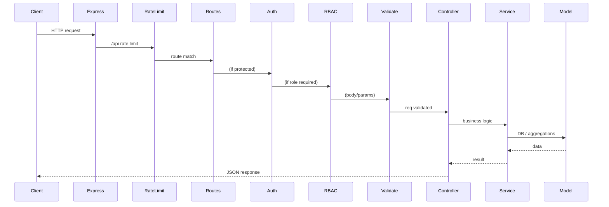

# Game Store API — Interview Prep (High Level)

A single high-level overview of the project for interview preparation. For per-feature Q&A and implementation details, see the linked feature docs. For Node/Express concepts used in this project, see [INTERVIEW-PREP-NODE-EXPRESS-CONCEPTS.md](INTERVIEW-PREP-NODE-EXPRESS-CONCEPTS.md).

---

## Project overview◊

**Game Store API** is an e-commerce backend for a digital game store. It provides:

- **Catalog**: Products (games) with search, filters, tags, related products, and Steam-style reviews.
- **Users & auth**: Register, login (JWT), profile, roles (user, admin, manager).
- **Shopping**: Cart (one per user), checkout (order from cart), mock payments, invoices.
- **Real-time**: Server-Sent Events (SSE) for “someone just purchased” toasts on the storefront.
- **Admin**: Order/invoice management, analytics dashboard (revenue, orders, top products, etc.).

Base URL: `http://localhost:5000` (or server origin). Full API reference: [API.md](API.md).

---

## Tech stack

| Layer | Technology |
|-------|------------|
| Runtime | Node.js |
| Framework | Express |
| Database | MongoDB (Mongoose) |
| Cache / rate limit | Redis (optional; in-memory fallback) |
| File storage | AWS S3 (product images, profile pictures) |
| Auth | JWT (jsonwebtoken), bcrypt |
| Validation | Zod |
| Logging | Winston |
| Email | SendGrid (mailer service; used by scripts e.g. cart abandonment, sale notifications) |

---

## Architecture

- **Request flow**: Client → Express (CORS, json, logger) → rate limit (per IP) → routes → auth → RBAC → validate → controller → service → model/aggregations. Errors go to global error handler.
- **Response**: Controllers return JSON (`success`, `data`, optional `meta`). Validation and auth failures return 4xx with `message` and optional `errors`.

---

## Directory structure

| Directory | Purpose |
|-----------|---------|
| `routes/` | Express routers; mount at `/api`; one file per feature (auth, products, users, cart, orders, etc.). |
| `controllers/` | HTTP layer: parse request, call service, send response. |
| `services/` | Business logic: use models, aggregations, external services (S3, mailer, recentPurchaseEvents). |
| `models/` | Mongoose schemas (User, Product, Cart, Order, Payment, Invoice, Address, Review). |
| `middlewares/` | auth (JWT), RBAC (requireRole), validate (Zod), rateLimit, upload (Multer), requestLogger. |
| `validators/` | Zod schemas per feature (auth, product, order, etc.). |
| `config/` | db (Mongoose connect), env (dotenv), logger (Winston), redis, s3. |
| `aggregations/` | MongoDB aggregation pipelines (e.g. product tags, related-by-tags). |
| `utils/` | Helpers (e.g. reviewSummary, generateSecret). |
| `templates/` | Email templates. |

---

## Feature map

| Feature | Base path | Main APIs | Feature doc |
|---------|-----------|-----------|-------------|
| Auth | `/api/auth` | POST register, POST login | [interview-prep-auth.md](interview-prep-auth.md) |
| Products | `/api/products` | List, tags, get, related, reviews, CRUD, image upload | [interview-prep-products.md](interview-prep-products.md) |
| Users | `/api/users` | List, me, get by id, create, profile picture, update, delete | [interview-prep-users.md](interview-prep-users.md) |
| Addresses | `/api/addresses` | List, get, create, update, delete, set-default | [interview-prep-addresses.md](interview-prep-addresses.md) |
| Cart | `/api/cart` | Get, add item, update quantity, remove item, clear | [interview-prep-cart.md](interview-prep-cart.md) |
| Orders | `/api/orders` | Create (checkout), list mine, get by id, get invoice | [interview-prep-orders.md](interview-prep-orders.md) |
| Payments | `/api/payments` | Create, get, confirm (mock) | [interview-prep-payments.md](interview-prep-payments.md) |
| Events (SSE) | `/api/events` | GET recent-purchases (stream) | [interview-prep-events-sse.md](interview-prep-events-sse.md) |
| Invoices | `/api/invoices` | Get by id (user); admin: list, get, update | [interview-prep-invoices.md](interview-prep-invoices.md) |
| Admin | `/api/admin` | Analytics, orders (list, update status), invoices (list, get, update) | [interview-prep-admin.md](interview-prep-admin.md) |

---

## Cross-cutting concerns

- **Authentication**: JWT in `Authorization: Bearer <token>`. Verified in `auth.middleware.js`; sets `req.user = { id, email, role }`. Used on all protected routes.
- **Authorization (RBAC)**: `requireRole(["admin", "manager"])` or similar after auth. Roles: `user`, `admin`, `manager`.
- **Validation**: Zod schemas in `validators/*.schema.js`; `validate(schema, "body"|"params"|"query")` middleware returns 400 with `errors` array on failure.
- **Rate limiting**: Global 100 req/min per IP on `/api`; Redis if configured, else in-memory. Auth routes (register/login) use stricter limit (e.g. 5/min per IP). Response headers: `X-RateLimit-Limit`, `X-RateLimit-Remaining`.
- **CORS**: Origin allowlist from `CORS_ORIGIN` (env); credentials allowed; OPTIONS handled for all paths.
- **Error handling**: Global 4-arg middleware; Mongoose ValidationError → 400 with `errors`; else `err.statusCode` or 500, with `message`.

---

## Key flows

1. **Login**  
   POST `/api/auth/login` (email, password) → auth service validates → bcrypt compare → JWT signed with `JWT_SECRET` → response returns `user` (id, email, name, role) and `token`, `expiresIn`. Client stores token and sends it in `Authorization` for protected routes.

2. **Checkout**  
   User has cart (GET `/api/cart`). Checkout: POST `/api/orders` (optional `addressId`) → order created from cart (snapshot of items, GST, total), cart cleared → client gets `orderId`. Then POST `/api/payments` with `orderId` → get `mockPaymentUrl` and `paymentId`. Client simulates “Pay now” → POST `/api/payments/:id/confirm` → payment captured, order marked paid and completed, invoice created, recent-purchase event emitted for SSE.

3. **Recent purchases (SSE)**  
   Payment confirm → payment service calls `recentPurchaseEvents.addRecentPurchase({ buyerName, country, productTitles, orderId })` → in-memory store keeps last 50 events and broadcasts to all open SSE connections (GET `/api/events/recent-purchases`). Browsers show “Alex from India purchased Elden Ring”–style toasts.

---

## Enums / constants

(Full details in [API.md](API.md).)

- **User roles**: `user`, `admin`, `manager`
- **Product platform**: `PC`, `PS5`, `XBOX`, `SWITCH`
- **Order status**: `pending`, `completed`, `cancelled`
- **Order payment status**: `unpaid`, `pending`, `paid`, `failed`, `refunded`
- **Payment status**: `created`, `authorized`, `captured`, `failed`
- **Invoice status**: `draft`, `issued`

---

## Quick reference: where to look

- **API contract**: [API.md](API.md)
- **Cart/order design**: [orders-carts-design.md](orders-carts-design.md)
- **SSE deep dive**: [SSE-and-recent-purchases-interview-guide.md](SSE-and-recent-purchases-interview-guide.md)
- **Node/Express concepts in this project**: [INTERVIEW-PREP-NODE-EXPRESS-CONCEPTS.md](INTERVIEW-PREP-NODE-EXPRESS-CONCEPTS.md)
- **Per-feature Q&A**: `interview-prep-*.md` files listed in the feature map above.
