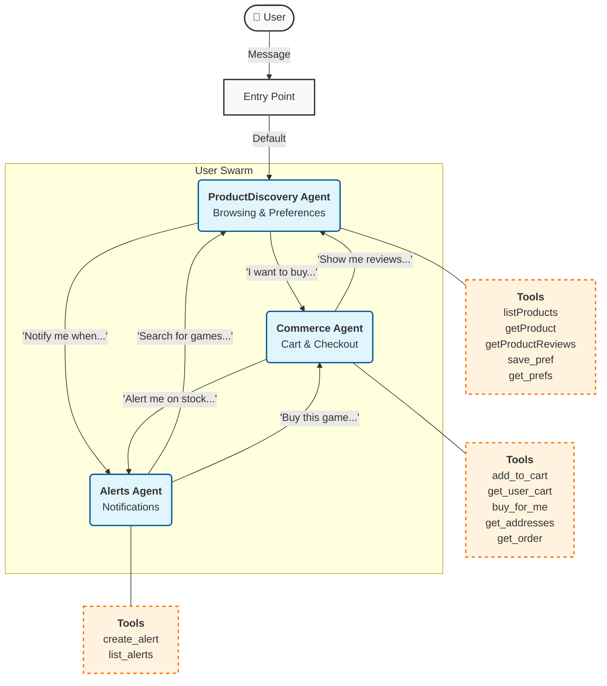
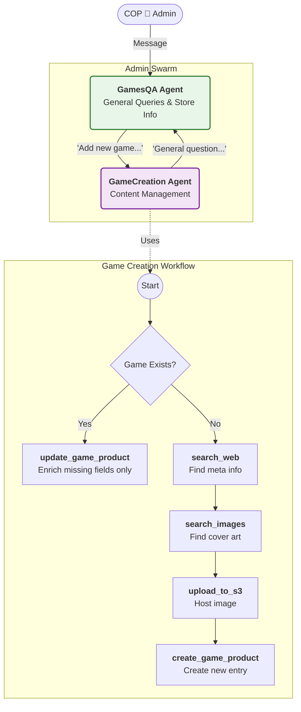
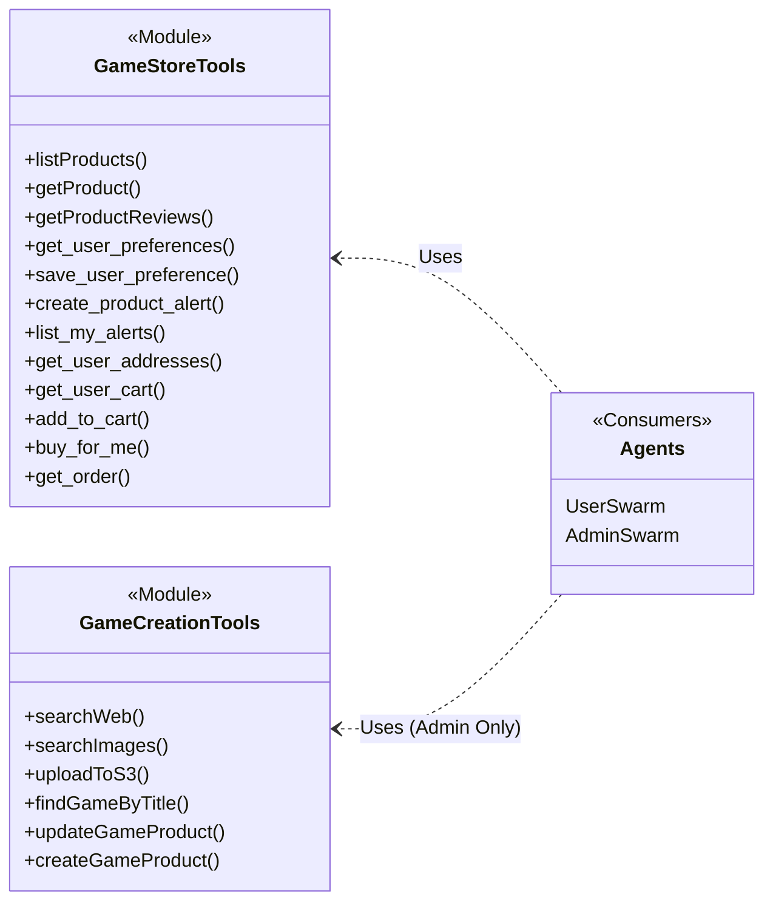

# LangChain Architecture & Flow Documentation

This document visualizes the agentic architecture of the Game Store application, utilizing **LangChain**, **LangGraph**, and **LangGraph Swarm**.

## System Overview

The application is divided into two distinct arbitrary "swarms" (multi-agent systems) to handle different types of users:

1.  **User Swarm**: Handles customer interactions (browsing, buying, alerts).
2.  **Admin Swarm**: Handles store management (adding games, enriching metadata).

---

## 1. User Facing Swarm Flow    

The **User Swarm** is orchestrated in `src/agents/game-store-user-swarm.js`. The default entry point is the **ProductDiscovery** agent.

### Agent Responsibilities

*   **ProductDiscovery**: The "Face" of the store. Handles fuzzy intent, searching, and recommending games.
*   **Commerce**: The "Cashier". Handles strict transactional logic, address retrieval, and payment flow.
*   **Alerts**: The "Notifier". Manages subscriptions for price drops and restocks.

---

## 2. Admin Facing Swarm Flow

The **Admin Swarm** is orchestrated in `src/agents/game-store-swarm.js`. The default entry point is the **GamesQA** agent.

### Agent Responsibilities

*   **GamesQA**: General purpose admin assistant. It has access to all "read" tools to answer questions about the store's current state.
*   **GameCreation**: Specialized implementation agent such as:
    *   **Research**: Searches the web for trailers, reviews, and metadata.
    *   **Asset Management**: Downloads images and uploads them to S3.
    *   **Database**: Writes authoritative records to the products database.

---

## 3. Tool Ecosystem & Technical Stack

The system functionality is exposed through discrete tools defined in `langchain`.

### Key Libraries
*   **@langchain/langgraph-swarm**: Manages the multi-agent state and handoffs.
*   **@langchain/groq**: Provides high-throughput inference (Llama 3) for the agents.
*   **@langchain/google-genai**: Fallback inference provider (Gemini).
*   **zod**: Ensures strict schema validation for all tool inputs, preventing malformed DB queries.
