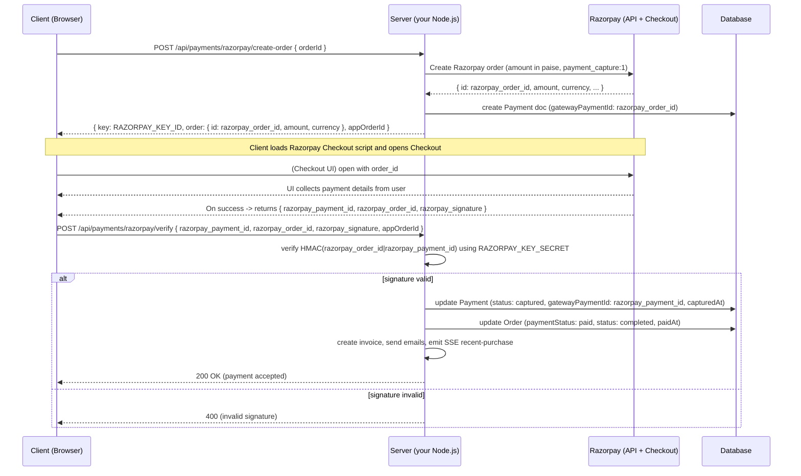
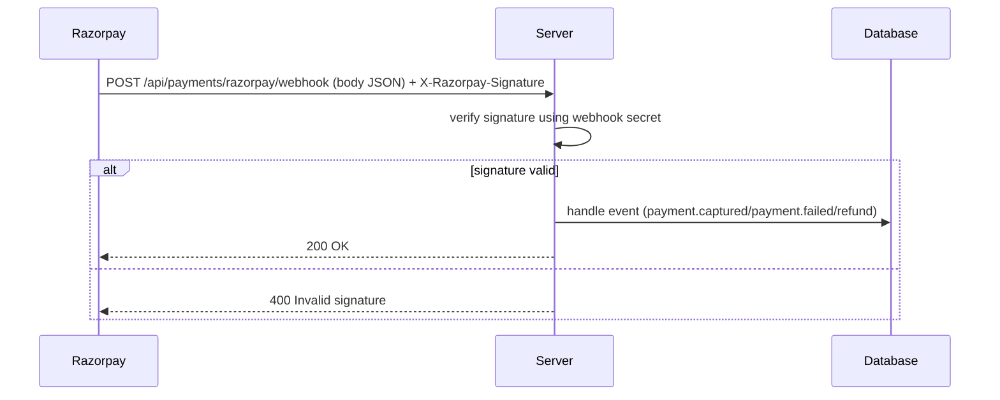

# Razorpay Integration Flow

This document explains the end-to-end Razorpay Checkout integration for this Node.js backend + Vite React frontend. It includes sequence diagrams (Mermaid), what the frontend calls, what the server does, webhook handling, success/failure behavior, and testing notes.

**Files / endpoints referenced**
- Backend create-order: `POST /api/payments/razorpay/create-order` (auth)
- Backend verify: `POST /api/payments/razorpay/verify` (auth)
- (Optional) Webhook: `POST /api/payments/razorpay/webhook`
- Config: `RAZORPAY_KEY_ID`, `RAZORPAY_KEY_SECRET` in server env (`.env`)

---

## Actors
- Frontend (browser, Vite + React)
- Backend (this Node.js server)
- Razorpay API / Checkout (razorpay.com)
- Database (MongoDB)

---

## Key principles
- Only the public `RAZORPAY_KEY_ID` is used in the browser; `RAZORPAY_KEY_SECRET` must remain on the server.
- A server-side Razorpay order is created first; this ensures the server controls amount, currency and prevents client tampering.
- Verify HMAC signatures server-side (sha256) before marking payments as paid.
- Use webhooks for async/reliable events (recommended) and verify webhook signatures.

---

## High-level sequence (mermaid)



---

## Detailed step-by-step flow

1. Checkout & server `Order` creation
   - Frontend performs normal checkout, creating an app `Order` via `POST /api/orders`.
   - The `Order` contains `totalAmount` (in rupees) and an `_id` (appOrderId).

2. Create a Razorpay Order (server)
   - Frontend calls `POST /api/payments/razorpay/create-order` with `{ orderId: appOrderId }`.
   - Server verifies order belongs to user and is unpaid.
   - Server computes `amountPaise = Math.round(totalAmount * 100)` and calls `razorpay.orders.create({ amount: amountPaise, currency: 'INR', receipt: String(appOrderId), payment_capture: 1, notes: { appOrderId } })`.
   - Razorpay returns `{ id: razorpay_order_id, amount, currency, ... }`.
   - Server writes a `Payment` doc in DB with `gatewayPaymentId` (razorpay_order_id), `status: 'created'`, `amount`, `metadata`.
   - Server responds to client with `{ key: RAZORPAY_KEY_ID, order: { id: razorpay_order_id, amount, currency }, appOrderId }`.

3. Client opens Razorpay Checkout (browser)
   - Client loads https://checkout.razorpay.com/v1/checkout.js and calls `new Razorpay(options)` with: `key`, `amount`, `currency`, `order_id`, `name`, `description`, `prefill`, `handler`.
   - `handler(response)` runs on success and receives `{ razorpay_payment_id, razorpay_order_id, razorpay_signature }`.

4. Client -> Server verification
   - Client sends these three values + `appOrderId` to `POST /api/payments/razorpay/verify` (authenticated).
   - Server computes HMAC: `expected = hmac_sha256(RAZORPAY_KEY_SECRET, razorpay_order_id + '|' + razorpay_payment_id)`.
   - If `expected === razorpay_signature`:
     - Update `Payment` in DB: `status: 'captured'` (or `captured` enum), `gatewayPaymentId` set to `razorpay_payment_id`, `capturedAt` timestamp, store the razorpay ids in metadata.
     - Update `Order`: `paymentStatus: 'paid'`, `status: 'completed'`, `paidAt`, set `payment` reference.
     - Create invoice (optional), send confirmation email, emit recent-purchase SSE event.
     - Respond 200 OK to client.
   - Else respond 400 invalid signature and do NOT mark paid.

5. (Optional) Manual capture flow
   - If server sets `payment_capture: 0` (manual capture), after verifying signature the server must call Razorpay Capture API: `razorpay.payments.capture(razorpay_payment_id, amountPaise)` before marking captured.

6. Webhook flow (recommended)
   - Configure Razorpay webhooks to `POST /api/payments/razorpay/webhook` for events like `payment.captured`, `payment.failed`, `refund.*`.
   - Razorpay sends webhook requests with header `X-Razorpay-Signature` (signature over body using webhook secret).
   - Server verifies webhook signature and processes event idempotently:
     - `payment.captured`: mark payment captured (if not already), mark order paid.
     - `payment.failed`: mark payment failed and notify user.
   - Webhooks are useful to reconcile cases where client never calls verify (network issues) or for asynchronous events.



---

## Failure scenarios & retries
- Client payment declined or failed: Razorpay returns failure to the client UI; client should show appropriate message and allow retry.
- Client receives success but fails to POST verify (network issue): rely on webhooks to receive `payment.captured` and reconcile state.
- Duplicate webhook or retry: ensure idempotent handler (check payment/gateway id before updating).

---

## Security and best practices
- Never expose `RAZORPAY_KEY_SECRET` in the client. Only send `RAZORPAY_KEY_ID` to client.
- Always verify the signature on `/verify` and on the webhook endpoint.
- Use `payment_capture: 1` (auto-capture) for simpler flows; use manual capture only if you need to authorize and capture later.
- Store Razorpay ids (`razorpay_order_id`, `razorpay_payment_id`) in Payment metadata to help debugging & reconciliation.
- Use a webhook secret for webhook verification (set in Razorpay dashboard) and verify `X-Razorpay-Signature`.

---

## Sample server-side verification snippet (Node.js)

```js
const crypto = require('crypto');
function verifySignature(razorpay_order_id, razorpay_payment_id, razorpay_signature) {
  const payload = `${razorpay_order_id}|${razorpay_payment_id}`;
  const expected = crypto.createHmac('sha256', process.env.RAZORPAY_KEY_SECRET).update(payload).digest('hex');
  return expected === razorpay_signature;
}
```

## Quick smoke-test checklist
1. Ensure `.env` contains `RAZORPAY_KEY_ID` and `RAZORPAY_KEY_SECRET` and restart server.
2. Create a normal app `Order` (via `POST /api/orders`).
3. Call `POST /api/payments/razorpay/create-order` with `orderId` (auth header).
4. Use returned `order.id` and `key` in the frontend to run Checkout, complete payment using Razorpay test cards.
5. After Checkout, confirm `/api/payments/razorpay/verify` is called by client; observe server updates in DB and invoice/email/SSE behavior.
6. Optionally configure webhooks and verify webhook handler receives and verifies events.

---

## References
- Razorpay Checkout docs: https://razorpay.com/docs/payments/checkout/
- Orders API: https://razorpay.com/docs/api/orders/
- Payments API (capture): https://razorpay.com/docs/api/payments/
- Webhooks: https://razorpay.com/docs/api/webhooks/

---

*Document created to help frontend and backend developers implement and test Razorpay integration correctly.*
