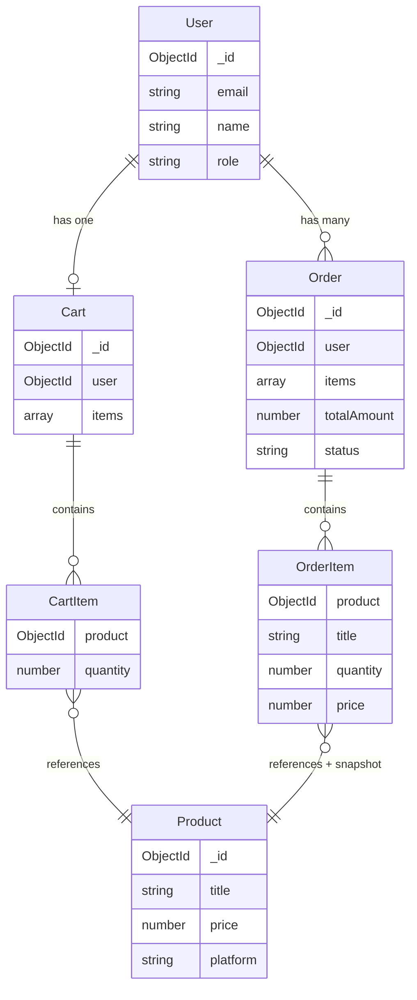

# Orders & Carts — Design & Linking

## Summary

- **Cart**: One per user (1:1). Holds **live** references to products and quantities; price comes from Product at read time.
- **Order**: Many per user (1:N). Created from the cart at checkout; each order **snapshots** product ref + title, quantity, and price. Cart is cleared after order creation.
- **Product**: Referenced by both Cart items and Order items. No back-references to Cart or Order.

---

## Entity relationship (high level)

```
                    ┌─────────────┐
                    │    User     │
                    │ (email,     │
                    │  name,      │
                    │  role…)     │
                    └──────┬──────┘
                           │
           ┌───────────────┼───────────────┐
           │               │               │
           │ 1:1           │ 1:N           │
           ▼               ▼               │
    ┌─────────────┐  ┌─────────────┐       │
    │    Cart     │  │   Order     │       │
    │ user (ref)  │  │ user (ref)  │       │
    │ items[]     │  │ items[]     │       │
    └──────┬──────┘  │ totalAmount │       │
           │         │ status      │       │
           │         └──────┬──────┘       │
           │                │              │
           │    ┌───────────┴───────────┐  │
           │    │  (embedded subdocs)   │  │
           │    │  CartItem / OrderItem │  │
           │    └───────────┬───────────┘  │
           │                │              │
           └────────────────┼──────────────┘
                            │
                            │ ref (ObjectId)
                            ▼
                    ┌─────────────┐
                    │   Product   │
                    │ title,      │
                    │ price,      │
                    │ platform…   │
                    └─────────────┘
```

---

## Detailed schema linking

### Cart

| Field   | Type     | Links to   | Notes                    |
|---------|----------|------------|--------------------------|
| `user`  | ObjectId | **User**   | Required, **unique** → 1 cart per user |
| `items` | array    | —          | Array of CartItem (embedded) |

**CartItem (embedded, no `_id`):**

| Field      | Type     | Links to   | Notes        |
|------------|----------|------------|--------------|
| `product`  | ObjectId | **Product**| Required     |
| `quantity` | Number   | —          | Min 1        |

- Cart does **not** store price; it’s read from Product when needed.

---

### Order

| Field         | Type     | Links to   | Notes                          |
|---------------|----------|------------|--------------------------------|
| `user`        | ObjectId | **User**   | Required → many orders per user |
| `items`       | array    | —          | Array of OrderItem (embedded)   |
| `totalAmount` | Number   | —          | Sum at checkout time           |
| `status`      | String   | —          | `pending` \| `completed` \| `cancelled` |

**OrderItem (embedded, no `_id`):**

| Field      | Type     | Links to   | Notes                          |
|------------|----------|------------|--------------------------------|
| `product`  | ObjectId | **Product**| Reference for display          |
| `title`    | String   | —          | **Snapshot** from Product      |
| `quantity` | Number   | —          | At checkout                    |
| `price`    | Number   | —          | **Snapshot** from Product      |

- Order **snapshots** title and price so history stays correct if Product changes later.

---

## Checkout flow (Cart → Order)

```
  User
    │
    │  POST /api/orders (create order from cart)
    ▼
  Cart (find by user)
    │
    │  populate('items.product')
    │  Filter: only active products
    │  Build orderItems: product, title, quantity, price
    │  totalAmount = Σ (price × quantity)
    ▼
  Order.create({ user, items, totalAmount, status: 'pending' })
    │
    │  cart.items = []
    │  cart.save()
    ▼
  Cart cleared
```

So the **linking** at checkout is: **User → Cart (by user id) → Cart.items[].product → Product**; then a new **Order** is created with **Order.user = User** and **Order.items[].product = Product** (plus snapshot fields). There is no direct Cart ↔ Order link; the relationship is “order is created from cart, then cart is emptied.”

---

## Mermaid diagram (for rendering)



---

## File reference

| Concern        | File |
|----------------|------|
| Cart model     | `src/models/cart.model.js` |
| Order model    | `src/models/order.model.js` |
| Cart → Order   | `src/services/order.service.js` → `createOrderFromCart(userId)` |
| User model     | `src/models/user.model.js` |
| Product model  | `src/models/product.model.js` |
